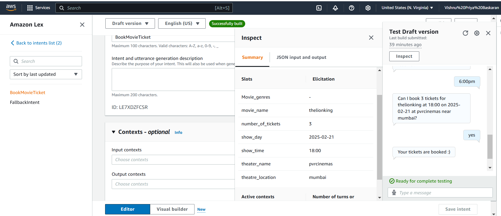

# 🎬 AI-Powered Movie Ticket Booking Bot  

## 📌 Overview  
This project is a **Conversational AI bot** for **movie ticket booking**, utilizing **Amazon Lex, AWS Lambda, Amazon DynamoDB, Twilio, and Kommunicate**. The bot allows users to book movie tickets seamlessly via **WhatsApp and a web-based chatbot** while automating customer support.  

---

## 🚀 Features  
✅ **Conversational Booking** – AI-driven chatbot for movie ticket reservations  
✅ **WhatsApp Integration** – Users can interact via WhatsApp using Twilio  
✅ **Web Chatbot Integration** – Kommunicate-based chatbot for browser users  
✅ **Automated Customer Support** – AI handles queries and guides users  
✅ **AWS-Powered** – Amazon Lex for NLP, AWS Lambda for business logic.

---

## ⚙️ Technologies Used  
- **Amazon Lex** – For building the chatbot  
- **AWS Lambda** – For backend logic and slot validation  
- **Amazon DynamoDB** – For storing movie, theatre, and booking details  
- **Twilio API** – For WhatsApp integration  
- **Kommunicate** – For embedding the chatbot on a webpage  

---

## 🛠 Implementation Steps  

### ✅ **1. Creating the Amazon Lex Chatbot**  
- Designed **Intents** & **Slots** to handle user inputs  

---

### ✅ **2. Integrating AWS Lambda for Data Retrieval & Slot Validation**  
- Connected **AWS Lambda** to retrieve movie names, show timings, and theatre names  
- Implemented **slot validation** to ensure correct inputs  
- Managed **intent validation & session state** for a smooth booking experience
   - Implemented **Dialog Actions** for conversation flow:
  - `Close` – End conversation  
  - `Delegate` – Let Lex manage interaction  
  - `ElicitSlot` – Ask for missing details  
  - `ElicitIntent` – Clarify user intent

---

### ✅ **3. WhatsApp Integration with Twilio**  
1️⃣ Created a **Twilio account & number**  
2️⃣ Built a **Lex bot & alias**  
3️⃣ Integrated **Amazon Lex with Twilio**  
4️⃣ Connected **WhatsApp with Twilio**  
5️⃣ **Enabled WhatsApp-to-Lex interactions**  
    

Now, users can book tickets simply by chatting with the bot on **WhatsApp**. 🎟📲  
  
---

### ✅ **4. Web Integration with Kommunicate**  
- Embedded the AI chatbot on a webpage  
- Enabled **real-time interactions** for seamless booking  
- Automated customer support to handle queries  

Users can now access the bot via **both WhatsApp and the website** for an effortless booking experience. 🚀  

---

## 📌 Next Steps  
🔹 Optimize responses for better user experience  
🔹 Add payment integration for completing bookings  
🔹 Expand bot capabilities with personalized recommendations  

---
