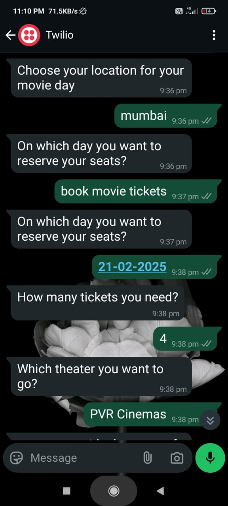
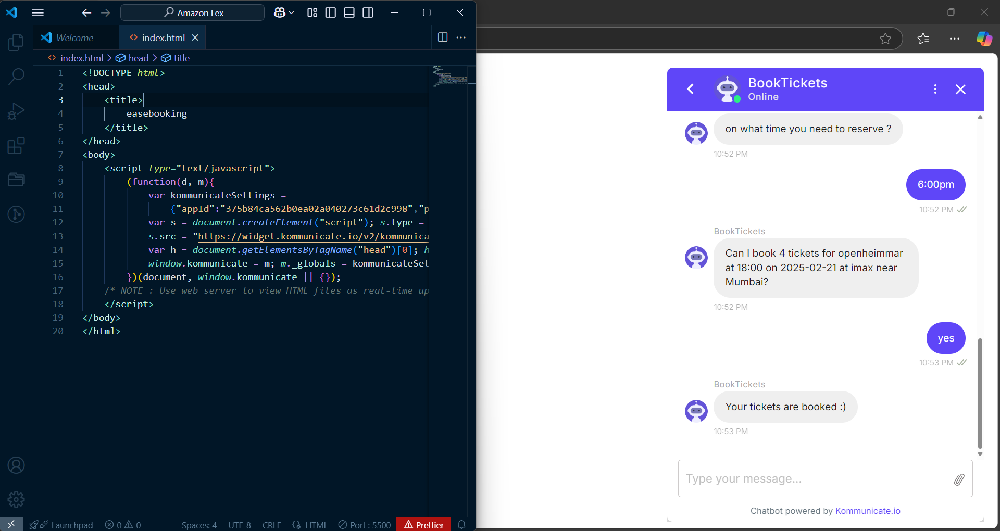

# 🎬 AI-Powered Movie Ticket Booking Bot  

## 📌 Overview  
This project is a **Conversational AI bot** for **movie ticket booking**, utilizing **Amazon Lex, AWS Lambda, Twilio, and Kommunicate**. The bot allows users to book movie tickets seamlessly via **WhatsApp and a web-based chatbot** while automating customer support.  

---

## 🚀 Features  
✅ **Conversational Booking** – AI-driven chatbot for movie ticket reservations  
✅ **WhatsApp Integration** – Users can interact via WhatsApp using Twilio  
✅ **Web Chatbot Integration** – Kommunicate-based chatbot for browser users  
✅ **Automated Customer Support** – AI handles queries and guides users  
✅ **AWS-Powered** – Amazon Lex for NLP, AWS Lambda for business logic.

---

## ⚙️ Technologies Used  
- **Amazon Lex** – For building the chatbot  
- **AWS Lambda** – For backend logic and slot validation  
- **Twilio API** – For WhatsApp integration  
- **Kommunicate** – For embedding the chatbot on a webpage  

---

## 🛠 Implementation Steps  

### ✅ **1. Creating the Amazon Lex Chatbot**  
- Designed **Intents** & **Slots** to handle user inputs  
#### **Intent & Slot Configuration**  
- **Intent** – Represents an action the user wants to perform. A bot can support multiple intents.  
- **Intent Name** – A unique name for each action (e.g., `BookMovieTicket`).  
- **Sample Utterances** – Example phrases a user might say, like:  
  - `"I want to book a movie ticket."`  
  - `"Can I get tickets for Spider-Man?"`  
- **Fulfilling the Intent** – Uses AWS Lambda to process the request.  

#### **Slots & Slot Types**  
- Each **intent** can require multiple **slots** (parameters).  
- Example slots for **movie ticket booking**:  
  - 🎬 **Movie Name** – The name of the movie  
  - 🏢 **Theatre Name** – The location of the theatre  
  - ⏰ **Show Timing** – Time of the movie  
  - 🎟 **Number of Tickets** – How many tickets to book  

- **Slot Type** – Defines the valid values a user can provide:  
  - `MovieName` – List of available movies  
  - `TheatreLocation` – Predefined locations  
  - `ShowTime` – Morning, Evening, Night  

At runtime, **Amazon Lex prompts users** for missing slot values and processes the booking once all required slots are filled.  

---

### ✅ **2. Integrating AWS Lambda for Data Retrieval & Slot Validation**  
- Connected **AWS Lambda** to retrieve movie names, show timings, and theatre names  
- Implemented **slot validation** to ensure correct inputs  
- Managed **intent validation & session state** for a smooth booking experience
   - Implemented **Dialog Actions** for conversation flow:
  - `Close` – End conversation  
  - `Delegate` – Let Lex manage interaction  
  - `ElicitSlot` – Ask for missing details  
  - `ElicitIntent` – Clarify user intent

---

### ✅ **3. WhatsApp Integration with Twilio**  
1️⃣ Created a **Twilio account & number**  
2️⃣ Built a **Lex bot & alias**  
3️⃣ Integrated **Amazon Lex with Twilio**  
4️⃣ Connected **WhatsApp with Twilio**  
5️⃣ **Enabled WhatsApp-to-Lex interactions**  
    

Now, users can book tickets simply by chatting with the bot on **WhatsApp**. 🎟📲  
  
---

### ✅ **4. Web Integration with Kommunicate**  
- Embedded the AI chatbot on a webpage  
- Enabled **real-time interactions** for seamless booking  
- Automated customer support to handle queries  

Users can now access the bot via **both WhatsApp and the website** for an effortless booking experience. 🚀  

---

### Watch Demo Here !!!!

## 📌 Next Steps  
🔹 Optimize responses for better user experience  
🔹 Add payment integration for completing bookings  
🔹 Expand bot capabilities with personalized recommendations  

---
